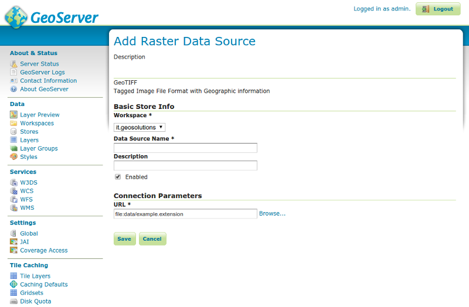

# GIS Data Provider - Installation and Administration Guide

Introduction
============

The purpose of this document is to provide information how to set up GIS
data service.

System Requirements
===================

Setup has been verified with:

-   Ubuntu 14.04
-   OpenJDK 7
-   Maven 2
-   Git

Hardware Requirements
---------------------

Configuration has been tested with:

-   Intel i5
-   8GB RAM

Operating System Support
------------------------

System configuration has been verified with Ubuntu version 14.04.

Software Requirements
---------------------

Required and verified toolset to run the GIS Data Provider:

-   OpenJDK 7
-   Tomcat 7

Software Installation and Configuration
=======================================

Required toolset
----------------

### Tools for building from source code

-   Tools
    -   OpenJDK 7
    -   Maven 2
    -   Git
    -   PostgreSQL
    -   PostGis

Tools can be installed with following command: 
    sudo apt-get install maven2 openjdk-7-jdk git postgresql-9.3-postgis-2.1

### Tools for package deploying

-   Tools
    -   OpenJDK 7
    -   PostgreSQL
    -   PostGis
    -   Tomcat7

Tools can be installed with following command: 
    sudo apt-get install openjdk-7-jdk git postgresql-9.3-postgis-2.1 tomcat7

Optional: pgadmin3 can be used for Postgis database management: 
    sudo apt-get install pgadmin3


Default username for PostgrSQL installation is *postgres*.
**createuser** -command in terminal shell creates new user to PostgreSQL
so that Linux / UNUX IDENT authentication can be used.

Setup GeoServer with W3DS and DDS community modules
---------------------------------------------------

FIWARE GIS Data Provider delivery provides 2 alternative ways to get GIS
service running:

-   getting and compiling source codes and running service with Jetty
    server

or

-   deploying ready compiled and packaged geoserver.war e.g. to tomcat.

NOTE: only one setup method is needed.

### Compile GeoServer and run it with Jetty server

For the latest version of the GeoServer it is recommended to build it
from the sourcecodes found from
[Github](https://github.com/Cyberlightning/geoserver/tree/fiware_rel_4.x "https://github.com/Cyberlightning/geoserver/tree/fiware_rel_4.x").

First Java, Maven and Git needs to be installed. After this GeoServer
codes can be cloned from
[Github](https://github.com/Cyberlightning/geoserver/tree/fiware_rel_4.x "https://github.com/Cyberlightning/geoserver/tree/fiware_rel_4.x").

GIS GE related changes are in fiware\_rel\_4.x brach and it can be
cloned with `git clone -b fiware_rel_4.x` from `https://github.com/Cyberlightning/geoserver.git`


After GeoServer project is cloned it needs to be build with Maven. In
addition to default GeoServer build command **-Pw3ds -Pdds** switchs
needs to be given. This enables build process also for W3DS module which
contains XML3D support and WorldWind Format Module which contains
support for image based elevation data. Build is done in **src**-folder
in root of GeoServer file structure.

    cd geoserver/src
    mvn install -DdownloadSources=true -Pw3ds -Pdds

Above command executes also automated tests. If Automated tests wants to
be skipped, it can be done by using **-DskipTests=true** -switch.

    mvn install -DdownloadSources=true -DskipTests=true -Pw3ds -Pdds

Build generates *geoserver.war* package to
*"Geoserver\_root\_directory"/src/web/app/target*.\
 After building GeoServer succesfull build is indicated similarly as
below examle shows: 


```
[INFO]
------------------------------------------------------------------------
[INFO] Reactor Summary:
[INFO]
[INFO] GeoServer ......................................... SUCCESS [0.757s]
[INFO] Core Platform Module .............................. SUCCESS [0.465s]
[INFO] Open Web Service Module ........................... SUCCESS [0.314s]
[INFO] Main Module ....................................... SUCCESS [2.328s]
[INFO] Web Feature Service Module ........................ SUCCESS [0.295s]
[INFO] Web Coverage Service Module ....................... SUCCESS [0.103s]
[INFO] Web Map Service Module ............................ SUCCESS [0.315s]
[INFO] GeoServer Web Modules ............................. SUCCESS [0.039s]
[INFO] Core UI Module .................................... SUCCESS [0.935s]
[INFO] Security UI Module ................................ SUCCESS [0.262s]
[INFO] GeoServer Security Modules ........................ SUCCESS [0.095s]
[INFO] GeoServer JDBC Security Module .................... SUCCESS [0.235s]
[INFO] GeoServer LDAP Security Module .................... SUCCESS [0.165s]
[INFO] Web Coverage Service 1.0 Module ................... SUCCESS [0.105s]
[INFO] Web Coverage Service 1.1 Module ................... SUCCESS [0.219s]
[INFO] KML support for GeoServer ......................... SUCCESS [0.114s]
[INFO] GeoWebCache (GWC) Module .......................... SUCCESS [0.164s]
[INFO] REST Support Module ............................... SUCCESS [0.078s]
[INFO] REST Configuration Service Module ................. SUCCESS [0.158s]
[INFO] WMS UI Module ..................................... SUCCESS [0.101s]
[INFO] GWC UI Module ..................................... SUCCESS [0.142s]
[INFO] WFS UI Module ..................................... SUCCESS [0.074s]
[INFO] Demoes Module ..................................... SUCCESS [0.094s]
[INFO] WCS UI Module ..................................... SUCCESS [0.093s]
[INFO] Community Space ................................... SUCCESS [0.028s]
**[INFO] WorldWind Format Module ........................... SUCCESS [15.518s]**
**[INFO] Web 3D Service .................................... SUCCESS [0.111s]**
[INFO] GeoServer Web Application ......................... SUCCESS [1.178s]
[INFO] GeoServer Extensions .............................. SUCCESS [0.174s]
[INFO]
------------------------------------------------------------------------
[INFO] BUILD SUCCESS
[INFO]
------------------------------------------------------------------------
[INFO] Total time: 9.834s
[INFO] Finished at: Wed Jun 24 15:29:48 EEST 2015
[INFO] Final Memory: 59M/726M
[INFO]
------------------------------------------------------------------------
```


Make sure that **Web 3D Service** and **WorldWind Format Module**
builds are successful. If building fails, verify that tools are
correctly installed and git repository is successfully cloned.

Now when GeoServer is successfully build, it can be launched.
GeoServer.war -package can be deployed in example to Tomcat, but since
Jetty is bundled to GeoServer source code package using it is
straightforward. To start GeoServer first go to
*"GeoServer\_root\_directory"/src/web/app* -directory and execute
following command: 

    cd web/app
    mvn -Djetty.port=9090 jetty:run -Pw3ds -Pdds

This starts GeoServer with W3DS module and assigns port 9090. Default
port for Jetty is 8080. When terminal shows
`[INFO] Started Jetty Server` -text jetty server has started
Geoserver. GeoServer admin panel can be find from the URI:
`localhost:9090/geoserver`. Default username is **admin** and password
**geoserver**.

The default control panel is shown below:


### Deploy provided geoserver.war

GIS Data Provider release contains generated *geoserver.war* packet
which is snapshot version from the released GE content. war-package can
be deployed in example to the Tomcat. For the latest version of the GIS
Data Provider implementation it is recommended to get GeoServer source
codes and build GeoServer as described in *Compile GeoServer and run it
with Jetty server* -section.

Configuration
-------------

### Setting up data assets

Setup process varies depended on what data type used asset is.

#### GeoTIFF based (DEM) data sets for elevation

NOTE: GeoTIFF data format for elevation data is only supported with
Octet-Stream output!

-   Stores -\> Add new Store -\> GeoTIFF
-   Set up correct workspace and name for Data Source
    -   When using FIWARE GIS GE reference web client used workspace
        needs to be named to **fiware**
-   Browse GeoTIFF file or write URL manually
    -   User account running Geoserver instance (f.ex. tomcat7) must
        have write rights to a folder containing image.
-   Save




-   Publish layer
    -   When publishing DEM layer it is important to make sure that
        source data SRS is recognized correctly. This can be verified in
        the *DATA*-tab. Correct SRS information should be possible to
        get from same place where source data was acquired.
        -   In case uncertain if `Native SRS` is not working correctly,
            define correct SRS manually to the `Declared SRS` -field.
            Set `SRS handling` to `Reproject native to declared` or
            `Force declared`.
    -   From Publishing tab set `Byte Order` to `Big Endian`


#### Polygon based data sets for elevation

Follow setup guide from Unit Testing Plan [Unit Testing
Plan](https://forge.fiware.org/plugins/mediawiki/wiki/fiware/index.php/GIS_Data_Provider_-_Unit_Testing_Plan#Test_setup "https://forge.fiware.org/plugins/mediawiki/wiki/fiware/index.php/GIS_Data_Provider_-_Unit_Testing_Plan#Test_setup")

#### Texture layers

Publish data sets used as a texture by following official GeoServer
guides.

-   [Raster data](http://docs.geoserver.org/stable/en/user/data/raster/index.html "http://docs.geoserver.org/stable/en/user/data/raster/index.html")
-   [Vector data](http://docs.geoserver.org/stable/en/user/data/vector/index.html "http://docs.geoserver.org/stable/en/user/data/vector/index.html")
-   [Getting Started](http://docs.geoserver.org/stable/en/user/gettingstarted/index.html "http://docs.geoserver.org/stable/en/user/gettingstarted/index.html")

### Memory configuration

Allocated memory usage in Jetty can be defined with
`DMAVEN\_OPTS="-Xmx2048m -Xms1024m"`. This can be done when Jetty server
is launched. For example: 

    DMAVEN_OPTS="-Xmx4096m -Xms2048m" mvn -Djetty.port=9090 jetty:run -Pw3ds -Pdds


### Configuration for allowing cross-origin requests

By default server doesn't allow cross-origin requests. Cross-origin
request can be allowed by adding following options to
`src/web/app/pom.xml` and `src/web/app/src/main/webapp/WEB-INF/web.xml`

Add new items as a last items under each section. In example put below
\<dependency\> as a last dependency definition in the pom.xml

src/web/app/pom.xml:

    <dependency>
      <groupId>org.eclipse.jetty</groupId>
      <artifactId>jetty-servlets</artifactId>
      <version>9.2.4.v20141103</version>
    </dependency>


src/web/app/src/main/webapp/WEB-INF/web.xml:

    <filter>
      <filter-name>cross-origin</filter-name>
      <filter-class>org.eclipse.jetty.servlets.CrossOriginFilter</filter-class>
    </filter>

    <filter-mapping>
      <filter-name>cross-origin</filter-name>
      <url-pattern>/*</url-pattern>
    </filter-mapping>


**NOTE: project must be rebuild for changes to take effect.**

Sanity check procedures
=======================

The Sanity Check Procedures are the steps that a System Administrator
will take to verify that an installation is ready to be tested. This is
therefore a preliminary set of tests to ensure that obvious or basic
malfunctioning is fixed before proceeding to unit tests, integration
tests and user validation.

End to End testing
------------------

If GeoServer started with suggested command, it is currently running on
localhost 9090 -port. To verify that GeoServer is running type
<http://localhost:9090/geoserver> to your web browser. Geoserver admin
panel should be opened. Default username is *admin* and password
*geoserver*. Login should be possible with these credentials. In the
main page there is **Service Capabilities**-section. Press
[0.4.0](http://localhost:9090/geoserver/ows?service=w3ds&version=0.4.0&request=GetCapabilities "http://localhost:9090/geoserver/ows?service=w3ds&version=0.4.0&request=GetCapabilities")
under **W3DS**, link requests GeoServer W3DS capabilities, server
responds this with XML-response. If response is successfully loaded to
new page GeoServer capability requests are done correctly.

GeoServer logs can be see in [Geoserver
logs](http://localhost:9090/geoserver/web/?wicket:bookmarkablePage=:org.geoserver.web.admin.LogPage "http://localhost:9090/geoserver/web/?wicket:bookmarkablePage=:org.geoserver.web.admin.LogPage").
Log information shows possible error situations which help to find
actual problem.

[GeoServer status](http://localhost:9090/geoserver/web/?wicket:bookmarkablePage=:org.geoserver.web.admin.StatusPage "http://localhost:9090/geoserver/web/?wicket:bookmarkablePage=:org.geoserver.web.admin.StatusPage")
page contains useful buttons to free memory, clear cache or reload
configuration. Using these can also help solving problem situation.

List of Running Processes
-------------------------

Verify that **Jetty** is running with following command: ``ps aux | grep jetty``

Network interfaces Up & Open
----------------------------

If proposed Jetty command is used, port 9090 should be free. If other
free port needs to be used, assign it correctly when starting Jetty
server.

Databases
---------

It is possible to store GIS data with 3D information straight to
GeoServer itself so separate database is not necessary required. However
database performs significantly better than internal data storage.
PostGis extension in PostgreSQL is one option to be used as a database.
More information of the PostGis usage with GeoServer can be found
[here](http://docs.geoserver.org/latest/en/user/data/database/postgis.html "http://docs.geoserver.org/latest/en/user/data/database/postgis.html").

As the database selection is user definable, the sanity check for it is
the same. However, if PostGIS has been installed as indicated by this
guide, the easiest way to sanity check its functionality is to use
pgAdmin3 tool, and login to the database with default used "postgres".
Having a successful connection with matching information about the
database structure visible via the tool will satisfy the sanity check
requirement.

Diagnosis Procedures
====================

Resource availability
---------------------

Just after start memory consumption is about 1,5GB. During testing
memory usage variation was between 3-4GB which was seen as normal
behavior.

GeoServer with modified W3DS module in Git requires \~300MB hard disk
space. Compiled geoserver.war package is \~60MB which can be deployed to
web server.

Remote Service Access
---------------------

The purpose of this GE is to serve geographical data for clients, either
browser or native based. There are no dedicated links for other enablers
for this purpose, however, nothing stops other enablers from using the
service via the same HTTP interface as the regular clients do.

Resource consumption
--------------------

Just after start memory consumption is about 1,5Gb. Normal memory usage
is between 3-4Gb. This estimation is based on the GIS GE test data
usage.

CPU usage is related to operations, e.g. CPU usage can vary between
0-100%.

I/O flows
---------

I/O flow amount is highly depend of the bounding box area and what is
the detail level inside bounding box. Therefore I/O flow can drastically
change even though requested bounding box area is same. I/O flow type is
HTTP and admin parameters can be encrypted.

