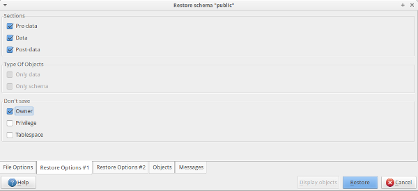
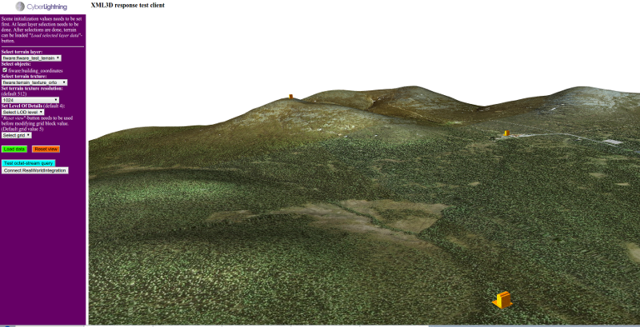

# Setup GIS Data Provider Test asset

Test asset can be downloaded from Forge:
[Test\_asset\_4.3.3.zip](https://forge.fiware.org/frs/download.php/1659/FIWARE-Test_asset_4.3.3.zip "https://forge.fiware.org/frs/download.php/1659/FIWARE-Test_asset_4.3.3.zip")

Test asset package content:
     
    Test_asset_4.3.3
    ├── 3D_terrain_data_shp (3D terrain data, shapefile)
    │   ├── terrain.dbf
    │   ├── terrain.qix
    │   ├── terrain.shp
    │   └── terrain.shx
    ├── Aero_photo_for_terrain_texture
    │   └── terrain_texture_orto.tif
    ├── Building_coordinates (building coordinates in WKB format, building name and URL to XML3D object)
    │   └── FI-WARE-building-coordinates.txt
    ├── Building_model (Building model in XML3D format)
    │   └── building.xml 
    ├── DEM_Geotiff (DEM file, grayscale elevation information)
    │   └── DEM_geotiff_terrain_EPSG3067.tiff
    ├── PostGIS_database_backup (For predefined test asset import to PostGis)
    │   ├── FIWARE-postgis-building_coordinates
    │   └── FIWARE-postgis-test_asset-terrain
    └── Raster_map_image_for_terrain_texture
        ├── terrain_texture_raster.tab
        ├── terrain_texture_raster.tfw
        └── terrain_texture_raster.tif

## Define GeoServer workspace for test asset

Open GeoServer and go to `Workspaces`. Select `Add new workspace` and name new workspace to **fiware**. `Namespace URI` needs to be defined as well. Set workspace as **Default Workspace** so that all new layers will be automatically assigned to this workspace.

## PostGIS and external XML3D definition files in GeoServer

Before proceeding create new database to PostGIS where GIS related data is stored. In Ubuntu environment pgAdmin provides nice GUI for managing PostGIS database and it's content.

### Import PostGIS database backup with terrain data

Test asset contains file named `FIWARE-postgis-test_asset-terrain` which is backup of PostGIS database and contains stored terrain data. Backup is provided for demonstrating PostGIS usage with GIS Data Provider GE.

*NOTE that if terrain data is imported to PostGIS, it is not necessary to import terrain data in shp-format as described in [terrain.shp](#terrain.shp).*

#### How to import data to PostGIS with pgAdmin
-   Go to GIS specific database in PostGIS and select *Restore*, restore dialog is opened
    -   **File options:** In *Filename* textbox navigate to location where you saved test files and select `FIWARE-postgis-test_asset-terrain`
    -   **Restore options \#1:**
        -   In the *Sections*-definition check `Pre-data, Data` and `Post-data` definitions to ensure that all data is  imported.
        -   In *Don't save* -definition, check `Owner` for not importing table owner data.
-   Press **Restore**-button
       -   pgAdmin restores backup data to you database.
-   After restore operation there should be new **fiware_test_terrain** table in your database with terrain data. This data can be accessed with GeoServer.

#### Import PostGIS database backup with building location data

PostGIS database backup with building coordinates information is stored to `FIWARE-postgis-building_coordinates` -file.

Backup contains coordinates for 3 buildings, and it works with provided test terrain. Backup file is in text format, so it can be modified already before importing it to local PostGIS installation. This is useful when URL's for building models needs to be updated. Data can be modified also after importing it to the local PostGIS, in example with pgAdmin.

Import command for PostGIS:

    psql -U [username] [database] < FIWARE-postgis-building_coordinates

    replace [username] with valid postgresql username
    replace [database] with database name where building coordinates backup should be imported

#### Specify building coordinates to PostGIS

If provided *FIWARE-postgis-building\_coordinates* database backup is not used, it is possible to manually define building location information to the PostGIS.

`FI-WARE-building-coordinates.txt` -file in test asset -package contains building coordinates in WKB format, building name and reference to XML3D object definition file. Used XML3D object is building.xml which is part of the given test asset. This xml file needs to be put the web server, where it can be accessed. When building.xml is freely available, replace file URL in the `FI-WARE-building-coordinates.txt` -file.

Create new table to PostGIS GIS database called **building_coordinates**. Add following columns to the table: **id**, **name**, **geom** and **mesh\_ref**. After this copy building name (e.g. pallas1) to the *name* -column, WKB presentation of the coordinate to the *geom* -column and XML3D file URL to the *mesh\_ref* column. After this there is new table defined in the PostGIS with 3 separate object (buildings) definitions which can be accessed by GeoServer.

#### PostGIS connection to GeoServer

After defining **fiware_test_terrain**- and **building_coordinates** -tables to the PostGIS we need to take them in use in the GeoServer. This is done by first defining PostGIS connection to GeoServer and then defining new layer to GeoServer which content is fetched from the *building_coordinates* -PostGIS table.

In GeoServer *Data* -section open *Stores* and select *Add new Store*. After this select *PostGIS - PostGIS Database* option, which leads to the PostGIS connection view. Add all needed data including database
name. Click *Save* and if PostGIS connection is succesfull *New Layer* -view is opened. Assuming new table in the PostGIS was defined as *building\_coordinates* this should be visible in the view. Select *Publish* in according line and *Edit layer* view is opened.

Important: GIS Test client assumes that if layer contains spatial points where XML3D objects should be linked, layer name should also contain "building\_coordinates" text. Otherwise Layer is not interpreted correctly and XML3D objects are not drawn to the scene.

For both **fiware\_test\_terrain**- and **building\_coordinates** -tables *Declared SRS* in the *Coordinate Reference Systems* should automatically have *EPSG:3047* value. If it isn't use *find* function. When SRS is defined Bounding Box values appears after clicking *Compute from native bounds*. Now move to *W3DS* tab and select *Activate* and *Queryable* in the *W3DS Settings*. In case terrain layer contains different Level of Details -information, it is important to select also **"Have LODs"** checkbox. Test data asset postgis terrain data contains LOD details. Without selecting **"Have LODs"** Level Of Details doesn't work for this layer.

After making all above adjustments *Save* -button can be pressed and new layer with XML3D objects is now taken in use in GeoServer.

## terrain.shp (alternative for importing postgis database backup)

In GeoServer select *Stores* -\> *New data source* -\> *Shapefile - ESRI(tm) Shapefiles (*.shp). Find `terrain.shp` and save new data source. **New Layer** -view appears, select *publish* action for newly created terrain layer and *Edit Layer* view is opened. *Data* -tab is automatically opened. Set layer name as **terrain**. *Declared SRS* field is empty, add **EPSG:3047** definition to there. After this *Compute from native bounds* can be pressed which automatically sets bounding box area correctly.

After setting Bounding box open **W3DS** tab and select both *Activate* and *Queryable* under W3DS Settings. for *Object ID* id value can be selected. When values are set, *Save* button can be pressed and new terrain layer is defined. 

**Note:** do not select *Have LODs* -selection, test shp doesn't contain LOD information

## Define terrain texture test asset in GeoServer

### terrain\_texture\_orto.tif and terrain\_texture\_raster.tif

**Note:** Terrain textures are served by the server via wms-interface, and
there's no need to declare W3DS related options for the textures. 

`terrain_texture_raster.tif` -file contains aero picture of the terrain, picture is used as terrain texture. Picture can be taken in the use by defining it as new `GeoTIFF` data store. `terrain_texture_raster.tab` and `terrain_texture_raster.tfw` -files needs to be same place with .tif file. When data store is defined,
publish its layer data. Set layer name as **terrain_texture_raster**. **Coordinate Reference Systems** data should be set by default, but in case it isn't, correct SRS is `EPSG:404000`. It is enough to set values
in **Data** tab, after verifying data there press *Save*.

*terrain_texture_orto.tif* contains raster image of the terrain (it doesn't have .tab and .tfw files). Create new data storage and publish it's layer similarly as with aero picture. Set layer name as **terrain_texture_orto**. In case SRS is not automatically defined it is `EPSG:3067`.

 *Reference web client running, terrain with texture loaded, 3 building
models visible as well.*